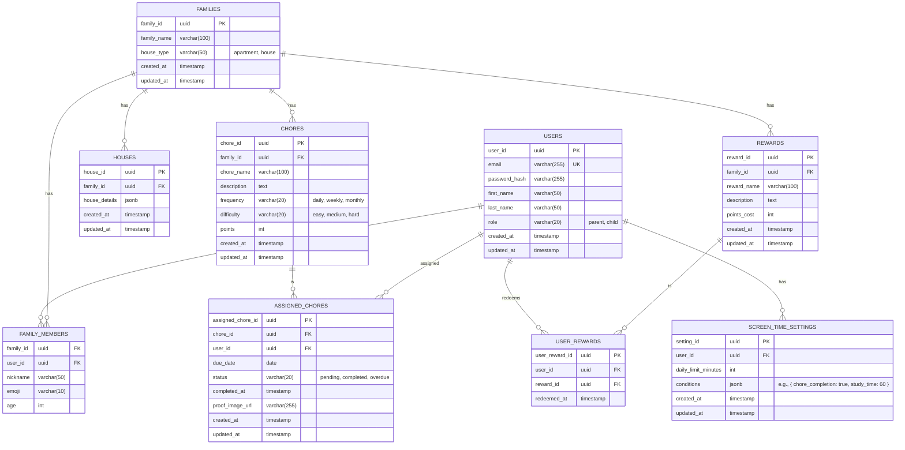

# Database Schema: Family Chore Management App

**Author:** Manus AI
**Date:** January 20, 2026

## 1. Introduction

This document defines the database schema for the family chore management application. The schema is designed for a PostgreSQL database and is optimized for scalability, data integrity, and query performance. It supports all core features of the application, including user management, family structures, chore planning, and the gamification system.

## 2. Schema Diagram

## 3. Table Definitions

### `USERS`

Stores information about individual users.

| Column | Data Type | Constraints | Description |
|---|---|---|---|
| `user_id` | `uuid` | Primary Key | Unique identifier for the user. |
| `email` | `varchar(255)` | Unique, Not Null | User's email address (for parents). |
| `password_hash` | `varchar(255)` | Not Null | Hashed password for authentication. |
| `first_name` | `varchar(50)` | | User's first name. |
| `last_name` | `varchar(50)` | | User's last name. |
| `role` | `varchar(20)` | Not Null | User's role (`parent` or `child`). |
| `created_at` | `timestamp` | Not Null | Timestamp of user creation. |
| `updated_at` | `timestamp` | Not Null | Timestamp of last user update. |

### `FAMILIES`

Stores information about each family unit.

| Column | Data Type | Constraints | Description |
|---|---|---|---|
| `family_id` | `uuid` | Primary Key | Unique identifier for the family. |
| `family_name` | `varchar(100)` | Not Null | The name of the family. |
| `house_type` | `varchar(50)` | | Type of house (`apartment`, `house`, etc.). |
| `created_at` | `timestamp` | Not Null | Timestamp of family creation. |
| `updated_at` | `timestamp` | Not Null | Timestamp of last family update. |

### `FAMILY_MEMBERS`

A join table linking users to families.

| Column | Data Type | Constraints | Description |
|---|---|---|---|
| `family_id` | `uuid` | Foreign Key (FAMILIES) | The family the user belongs to. |
| `user_id` | `uuid` | Foreign Key (USERS) | The user who is a member of the family. |
| `nickname` | `varchar(50)` | | Child's nickname. |
| `emoji` | `varchar(10)` | | Child's chosen emoji. |
| `age` | `int` | | Child's age. |

### `HOUSES`

Stores details about the family's house, captured via scanning.

| Column | Data Type | Constraints | Description |
|---|---|---|---|
| `house_id` | `uuid` | Primary Key | Unique identifier for the house details. |
| `family_id` | `uuid` | Foreign Key (FAMILIES) | The family the house belongs to. |
| `house_details` | `jsonb` | | JSON object storing room and asset information. |
| `created_at` | `timestamp` | Not Null | Timestamp of creation. |
| `updated_at` | `timestamp` | Not Null | Timestamp of last update. |

### `CHORES`

Stores the master list of chores for a family.

| Column | Data Type | Constraints | Description |
|---|---|---|---|
| `chore_id` | `uuid` | Primary Key | Unique identifier for the chore. |
| `family_id` | `uuid` | Foreign Key (FAMILIES) | The family the chore belongs to. |
| `chore_name` | `varchar(100)` | Not Null | The name of the chore. |
| `description` | `text` | | A detailed description of the chore. |
| `frequency` | `varchar(20)` | | How often the chore should be done. |
| `difficulty` | `varchar(20)` | | The difficulty level of the chore. |
| `points` | `int` | | The number of points awarded for completing the chore. |
| `created_at` | `timestamp` | Not Null | Timestamp of chore creation. |
| `updated_at` | `timestamp` | Not Null | Timestamp of last chore update. |

### `ASSIGNED_CHORES`

Tracks the assignment of chores to users.

| Column | Data Type | Constraints | Description |
|---|---|---|---|
| `assigned_chore_id` | `uuid` | Primary Key | Unique identifier for the assigned chore. |
| `chore_id` | `uuid` | Foreign Key (CHORES) | The chore that was assigned. |
| `user_id` | `uuid` | Foreign Key (USERS) | The user the chore was assigned to. |
| `due_date` | `date` | | The date the chore is due. |
| `status` | `varchar(20)` | Not Null | The status of the chore. |
| `completed_at` | `timestamp` | | Timestamp of when the chore was completed. |
| `proof_image_url` | `varchar(255)` | | URL of the uploaded proof image. |
| `created_at` | `timestamp` | Not Null | Timestamp of assignment. |
| `updated_at` | `timestamp` | Not Null | Timestamp of last update. |

### `REWARDS`

Stores the list of available rewards for a family.

| Column | Data Type | Constraints | Description |
|---|---|---|---|
| `reward_id` | `uuid` | Primary Key | Unique identifier for the reward. |
| `family_id` | `uuid` | Foreign Key (FAMILIES) | The family the reward belongs to. |
| `reward_name` | `varchar(100)` | Not Null | The name of the reward. |
| `description` | `text` | | A description of the reward. |
| `points_cost` | `int` | Not Null | The number of points required to redeem the reward. |
| `created_at` | `timestamp` | Not Null | Timestamp of reward creation. |
| `updated_at` | `timestamp` | Not Null | Timestamp of last reward update. |

### `USER_REWARDS`

Tracks which rewards have been redeemed by users.

| Column | Data Type | Constraints | Description |
|---|---|---|---|
| `user_reward_id` | `uuid` | Primary Key | Unique identifier for the redeemed reward. |
| `user_id` | `uuid` | Foreign Key (USERS) | The user who redeemed the reward. |
| `reward_id` | `uuid` | Foreign Key (REWARDS) | The reward that was redeemed. |
| `redeemed_at` | `timestamp` | Not Null | Timestamp of when the reward was redeemed. |

### `SCREEN_TIME_SETTINGS`

Stores screen time settings and conditions for each child.

| Column | Data Type | Constraints | Description |
|---|---|---|---|
| `setting_id` | `uuid` | Primary Key | Unique identifier for the setting. |
| `user_id` | `uuid` | Foreign Key (USERS) | The child the setting applies to. |
| `daily_limit_minutes` | `int` | | The daily screen time limit in minutes. |
| `conditions` | `jsonb` | | JSON object defining conditions for screen time. |
| `created_at` | `timestamp` | Not Null | Timestamp of setting creation. |
| `updated_at` | `timestamp` | Not Null | Timestamp of last setting update. |

## 4. Indexes

To optimize query performance, the following indexes should be created:

*   An index on the `email` column in the `USERS` table.
*   A composite index on `(family_id, user_id)` in the `FAMILY_MEMBERS` table.
*   An index on `family_id` in the `CHORES` table.
*   An index on `user_id` in the `ASSIGNED_CHORES` table.
*   An index on `chore_id` in the `ASSIGNED_CHORES` table.

This schema provides a solid foundation for the application, balancing normalization with performance considerations. It is designed to be extensible, allowing for the addition of new features in the future.
